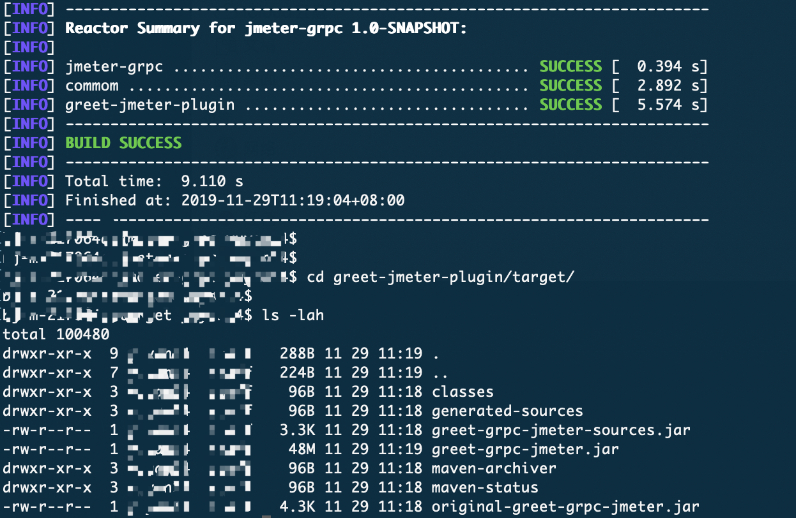
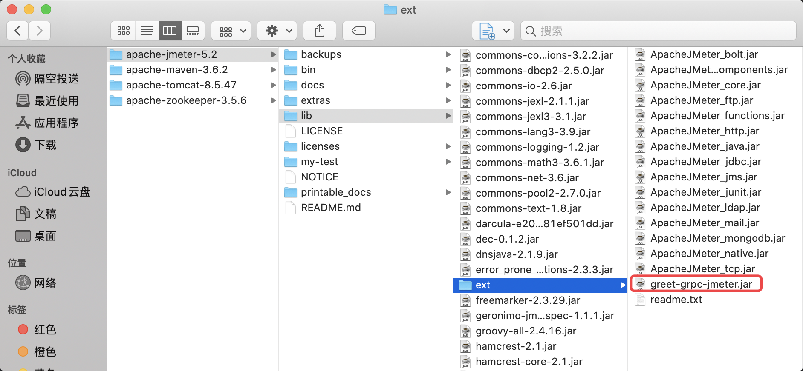
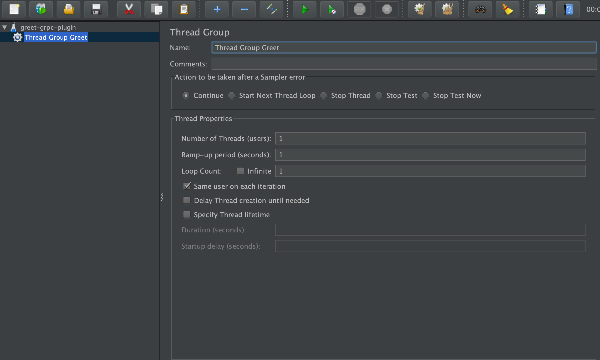
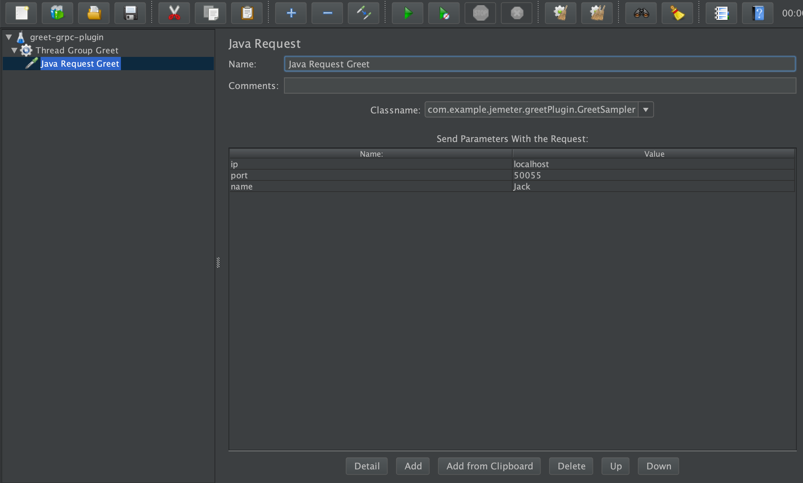
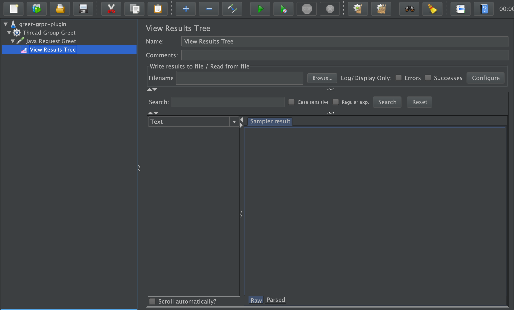
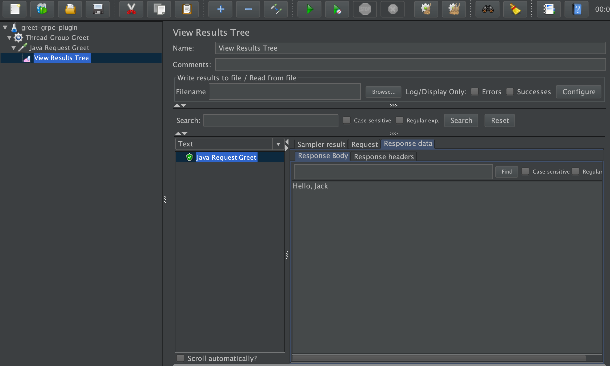

# jmeter-grpc

### 背景与目标
````
通过该插件实现使用jmeter对grpc接口进行测试，可以在此基础上修改适配自己需要测试的接口。   
grpc server和client基于自己写的一个grpc demo，地址：https://github.com/shuaijiasanshao/MyRepo/tree/master/grpc-greet 
````

### 工程结构
```
jmeter-grpc
├── common     存放公共代码，如调用server的client和protobuf文件
└── greet-jmeter-plugin   自定义jmeter测试执行代码   

```

### 使用说明
#### 一 编译工程
进入工程目录下，执行
````
> mvn clean install
````


> 得到jar: greet-grpc-jmeter.jar

#### 二 安装插件
把greet-grpc-jmeter.jar复制到jmeter安装目录的/lib/ext目录下 
 

#### 三 编写测试用例
* 新建线程组


* 新建Sampler


````
注意是新建Java Request，然后能看到自定义实现的jmeter测试类。 
需要填写参数主要包括:   
ip: grpc server 运行的IP地址  
port: grpc server 监听的端口号  
name: 例子里面发送greet用到的名字  
````

* 新建viewResultTree



#### 四 执行结果


````
jmx文件也放到了工程的jmx目录下，可以导入jmeter使用
````